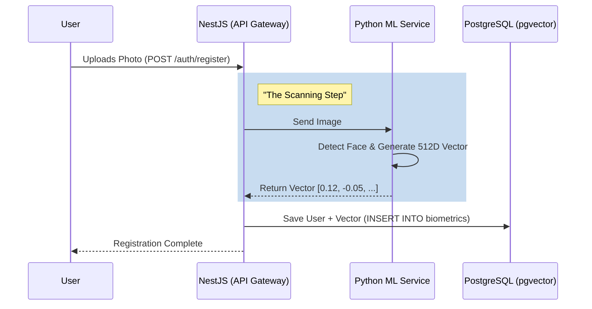
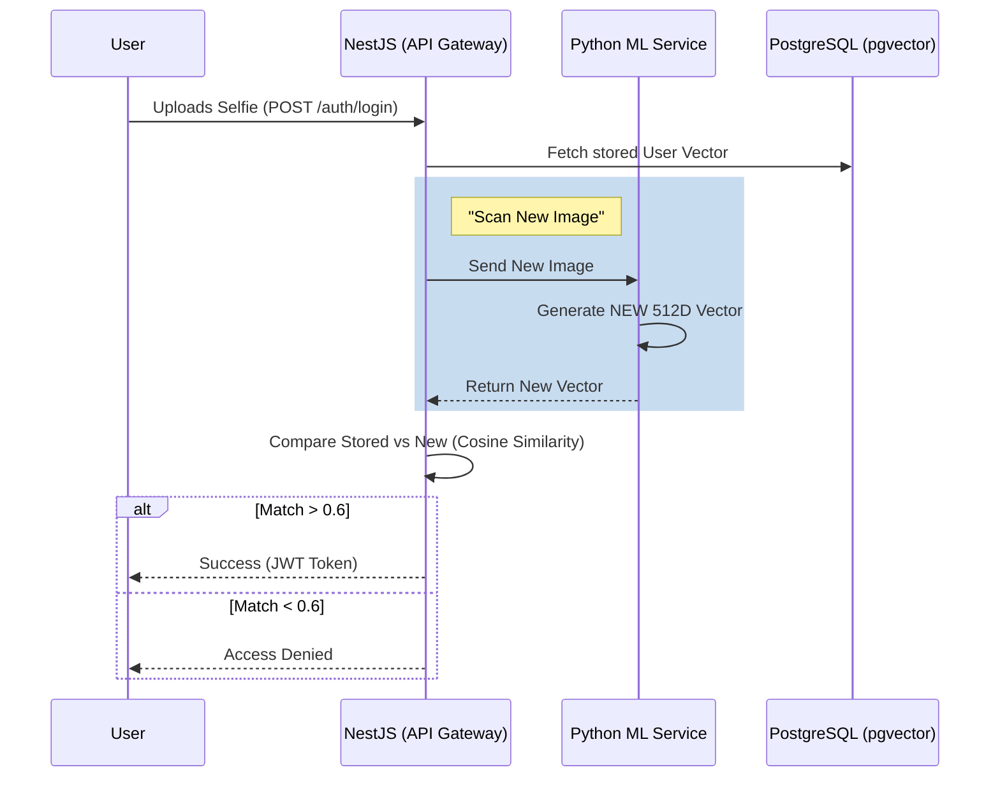

# System Architecture: How "Face Scanning" Works

This document explains how the **NestJS Backend**, **Python ML Service**, and **PostgreSQL** work together to implement face scanning and authentication.

## The Core Concept: Vectorization

"Scanning a face" in this system means converting a face image into a list of **512 numbers** (a vector). These numbers represent the unique features of a face.

- **Same Face** = Similar numbers (Vectors point in the same direction).
- **Different Face** = Different numbers (Vectors point in different directions).

## Data Flow Diagrams

### 1. Registration (scanning for the first time)

User uploads a photo. We don't store the photo itself for security; we store the **numbers**.

### 2. Login (Scanning to verify)

User uploads a new photo. We check if it matches the numbers we stored earlier.

## Component Roles

1.  **NestJS (API Gateway)**: The coordinator. It receives requests, talks to the "Brain" (ML Service), and saves results to the "Memory" (Database).
2.  **Python ML Service (The Brain)**: The only component that "sees" the face. It uses AI models (InsightFace) to turn pixels into numbers.
3.  **PostgreSQL + pgvector (The Memory)**: efficiently stores these high-dimensional vectors and can search them.
