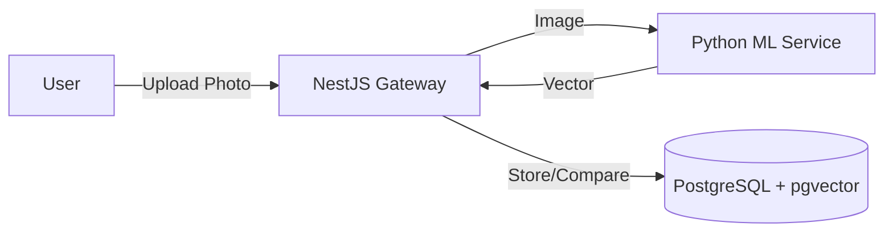

# Facial Biometric Auth System

A production-ready **Biometric Authentication System** featuring a **NestJS API Gateway**, **Python ML Service**, and **PostgreSQL with pgvector**.

## 🏗️ System Architecture

The system is split into three specialized components:

1.  **API Gateway (NestJS)**: The "Manager". Handles user requests, authentication logic, and coordinates between the user, database, and ML service.
2.  **ML Service (Python)**: The "Brain". A stateless container that purely converts face images into mathematical vectors (embeddings).
3.  **Database (PostgreSQL + pgvector)**: The "Memory". Stores user profiles and the 512-dimensional face vectors for fast similarity search.



---

## 🚀 Quick Start

### Prerequisites

- **Docker Desktop** installed and running.
- **Node.js** (v18+) installed.

### 1. Start Infrastructure (The Brain & Memory)

Start the Python ML Service and PostgreSQL Database.

```bash
docker-compose up -d --build
```

### 2. Setup Backend (The Manager)

Navigate to the `api-gateway` folder:

```bash
cd api-gateway
npm install
```

### 3. Initialize Database

Push the schema to the running database.

```bash
npx drizzle-kit push
```

### 4. Start the Server

```bash
npm run start:dev
```

The backend will run on `http://localhost:3000`.

---

## 🧪 Testing

You can test the system using `curl` commands.

### 1. Register (Enrollment)

Uploads an image. The system vectorizes it and saves the user.

**Windows PowerShell:**

```powershell
curl.exe -X POST http://localhost:3000/auth/register -F "email=test@example.com" -F "image=@../my_photo.jpg"
```

**Mac/Linux:**

```bash
curl -X POST http://localhost:3000/auth/register \
  -F "email=test@example.com" \
  -F "image=@../my_photo.jpg"
```

### 2. Login (Authentication)

Uploads a new image. The system vectorizes it, compares it with the saved vector, and issues an Access Token if they match.

**Windows PowerShell:**

```powershell
curl.exe -X POST http://localhost:3000/auth/login -F "email=test@example.com" -F "image=@../my_photo.jpg"
```

---

## 🧠 Key Concepts & FAQ

### Why are there two containers?

- **`face-api` (Python)**: Specialized for heavy AI math. It runs the Neural Networks.
- **`face-db` (Postgres)**: Specialized for storing data.
  This separation allows you to scale them independently. If you have millions of users, you might need 10 AI containers but still just one database.

### What is a "Vector"?

A **Vector** is a list of 512 numbers that represents the unique features of a face.

- We **never** compare images pixel-by-pixel (lighting changes would break it).
- Instead, we convert the face to these numbers.
- **Same Face** = Similar numbers (Vectors point in same direction).

### What is the "Access Token"?

The **Access Token** (JWT) is your "Guest Badge".

- **It is NOT the vector.** The vector is heavy and private data stored in the DB.
- The token is a lightweight encrypted string that says "This user verified their face at [Time]. Let them in."
- You use this token for subsequent requests so you don't have to scan your face for every single click.

### How do I change the token expiration?

By default, the token lasts **1 hour**. To change this:

1.  Open `api-gateway/src/auth/auth.module.ts`
2.  Find `signOptions: { expiresIn: '1h' }`
3.  Change it to `'1d'` (1 day), `'15m'` (15 mins), etc.

---

## 📁 Project Structure

```
facial-recognition-saas/
├── api-gateway/           # NestJS Backend
│   ├── src/
│   │   ├── auth/          # Auth Logic (Register, Login)
│   │   ├── db/            # Database Schema & Connection
│   │   └── app.module.ts  # Main Module
│   ├── drizzle.config.ts  # Database Config
│   └── package.json       # Node Dependencies
├── app/                   # Python ML Service Code
├── docker-compose.yml     # Container Orchestration
└── Dockerfile             # Python Service Dockerfile
```
